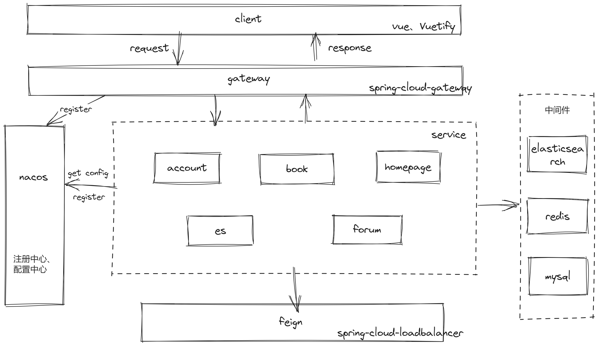

# Felix-您的数字阅读伴侣

### 项目简介
Felix，我的毕业设计项目，是一款专注于提供优质阅读体验的图书阅读应用。在这个数字化时代，Felix旨在重新定义移动阅读，将传统的阅读习惯与现代技术完美结合。

### 技术选型
| 框架或工具     | 名称                  |
|-----------|---------------------|
| web层框架    | springboot          |
| 持久层框架     | mybatis             |
| 配置中心、注册中心 | nacos               |
| 网关        | springcloud-gateway |
| 全文搜索引擎    | Elasticsearch       |
| 远程调用框架    | feign               |
| 缓存        | redis               |
| 数据库       | mysql               |
| 网络编程框架    | netty               |

### 系统公共模块
| No  | 工程模块          | 说明                        | 子模块                                                            |
|-----|---------------|---------------------------|----------------------------------------------------------------|
| 1   | felix-common  | 公共模块，存放通用的POJO、工具类、配置文件等。 | core、pojo、quartz、redis、web                                     |
| 2   | felix-gateway | 服务网关、权限验证                 |                                                                |
| 3   | felix-system  | 系统服务模块，包含体业务模块            | felix-book、felix-user、felix-homepage、felix-search、felix-search |
| 4   | felix-feign   | Feign客户端，提供微服务的公用客户端      | book-client、user-client、search-client                          |

### 系统服务模块（felix-system）

| No  | 具体的服务          | 说明                  | 使用的feign客户端                           |
|-----|----------------|---------------------|---------------------------------------|
| 1   | felix-book     | 图书中心，提供图书基础数据接口     |                                       |
| 2   | felix-user     | 账户中心，提供账户授权、用户服务等接口 | book-client                           |
| 3   | felix-homepage | 精品页中心，提供App精品页接口    | book-client、user-client、search-client |
| 4   | felix-forum    | 话题论坛                | book-client、user-client、search-client |
| 5   | felix-search   | 全文分词搜索              |                                       |

### 系统后端架构图


### Account服务 - reading-account
account 模块提供用户的注册、安全登录、用户书架、用户喜欢等业务；
#### 用户喜欢
业务场景：每一本书的右下角都有一个小心心，点击之后更新图书的粉丝数；

由于一本书的粉丝数不需要数据的强一致性，考虑到用户可能连续点击，所以可以采用多线程的方式去异步操作将数据同步
到数据库和缓存；这里使用到了自定义的线程池，通过springboot的自定义配置，可以配置我们的线程池参数；从而实现
该业务的高可用；

线程池配置部分代码：

    @Bean(value = "clickHeartThreadPool")
    public ExecutorService buildClickHeartThreadPool(){

        ThreadPoolProperties.ClickHeart clickHeart = this.threadPoolProperties.getClickHeart();

        ThreadFactory threadFactory = new ThreadFactoryBuilder()
                .setNameFormat(clickHeart.getThreadNamePrefix() + "-%d")
                .build();

        return new ThreadPoolExecutor(
                clickHeart.getCoreThreadSize(),
                clickHeart.getMaximumThreadSize(),
                clickHeart.getKeepAliveTime(),
                TimeUnit.MILLISECONDS,
                new ArrayBlockingQueue<>(clickHeart.getQueueCapacity()),
                threadFactory,
                new ThreadPoolExecutor.AbortPolicy()
        );
    }
--------------------------------------------------------------------------------------------
    @Data
    @Configuration
    @ConfigurationProperties(prefix = "mazhj.thread-pool")
    public class ThreadPoolProperties {

    private final ClickHeart clickHeart = new ClickHeart();

    private final SyncBookshelfData bookshelf = new SyncBookshelfData();

    @Data
    public static class ClickHeart{

        private int coreThreadSize = 1;

        private int maximumThreadSize = 5;

        private long keepAliveTime = 0;

        private int queueCapacity = 2048;

        private String threadNamePrefix = "thread-name-prefix";

    }

    @Data
    public static class SyncBookshelfData{

        private int coreThreadSize = 1;

        private int maximumThreadSize = 3;

        private long keepAliveTime = 0;

        private int queueCapacity = 10240;

        private String threadNamePrefix = "thread-name-prefix";
    }
    }

### Book服务 - reading-book
book 模块提供获取图书信息、查看图书详情、查看章节信息、阅读章节等业务；
#### 阅读章节
业务场景：用户点击一本图书后会看到相应的章节信息，即可以阅读章节内容

分析业务场景，阅读图书的每个章节内容，因为图书是对所有用户的属于公共资源，所以考虑将每章节的信息存入redis中；
每本书有自己独有的章节；所以在redis中存储应该存在两个key，一个是bookId，一个是chapterId，应使用hash 结构
存储数据即bookId为key chapterId为hash key；那么现在又出现新的问题了如果有一本书章节很多，阅读不同的章节都
需要区请求数据库，然后在一章一章的放入缓存这种，如果在书的数量少的时候这么做似乎没什么问题；但是考虑到性能的消耗，
这么存储是不高效的；

分析阅读时的操作：
- 上一章（第一章没有上一张）
- 下一章（最后一章没有下一张）

可以把一本书的所有章节看成一个链表然后在请求其中一章后直接将整个链表都放入redis中；这就大大提升了数据访问的效率。

链表节点结构：
```json
{
  "id": "",
  "name": "",
  "pre": {},
  "next": {}
}
```
### Homepage服务 - reading-homepage
homepage 模块提供图书排行榜、猜你喜欢、关键词搜索等业务；
#### 图书排行榜
业务场景：在主页最上方会有一个类似推荐榜的图书榜单；来供用户查看图书的排名信息；（每日的榜单是不同的）

目前该业务只是实现了一种排名策略（这块使用了策略模式）；根据每本书的粉丝数来排名，排名数据过期时间为1天这就意味着排名是日更的 
为了方便 扩展适应业务变更的需求，过期时间和排名策略支持自定义配置；

#### 猜你喜欢
业务场景：在主页会展示猜你喜欢图书列表；

猜你喜欢功能的实现，是根据前端传过来的本地搜索记录的一部分做范围匹配占比30%；用户书架同类别书占比70%；

### forum服务 - reading-forum

### es服务 - reading-es