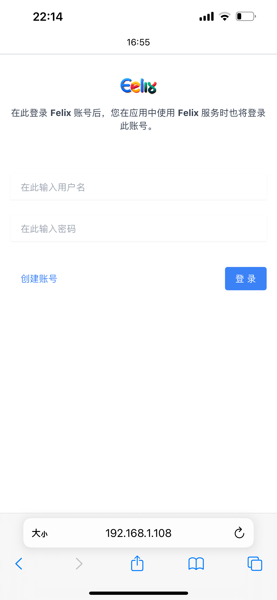
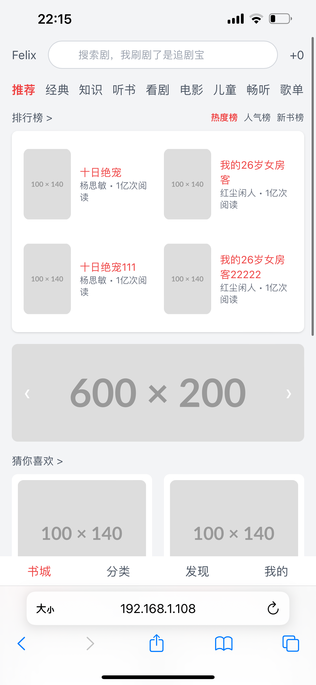

<p align="center" style="text-align: center">
	
</p>
<h3 align="center" style="margin: 30px 0 30px; font-weight: bold;">Felix-您的数字阅读伴侣</h3>

## 项目简介
Felix，我的毕业设计项目，是一款专注于提供优质阅读体验的图书阅读应用。在这个数字化时代，Felix旨在重新定义移动阅读，将传统的阅读习惯与现代技术完美结合。

---

## UI 设计
<div style="display: flex; background-color: aliceblue; height: 690px">
  
  
</div>


---

## 技术选型
<div style="display: flex; ">
  <div style="justify-content: flex-start; flex-grow: 0; margin-right: 100px">

| 框架或工具        | 名称                   | 
|--------------|----------------------|
| web层框架       | springboot           |
| 持久层框架        | mybatis              |
| 配置中心、注册中心    | nacos                |
| 网关           | spring cloud-gateway |
| 全文搜索引擎       | elasticsearch        |
| 远程调用框架       | feign                |
| 缓存           | redis                |
| 数据库          | mysql                |
| 网络编程框架       | netty                | 
  </div>
  <div style="justify-content: flex-end; flex-grow: 1">
    <p> Spring Boot - https://spring.io/projects/spring-boot </p>
    <p> MyBatis - http://www.mybatis.org/mybatis-3/zh/index.html </p>
    <p> Nacos - https://nacos.io/zh-cn/ </p>
    <p> Spring Cloud Gateway - https://spring.io/projects/spring-cloud-gateway </p>
    <p> Elasticsearch - https://www.elastic.co/elasticsearch/ </p>
    <p> OpenFeign - https://github.com/OpenFeign/feign </p>
    <p> Redis - https://redis.io/ </p>
    <p> MySQL - https://www.mysql.com/ </p>
    <p> Netty - https://netty.io/ </p>
  </div>
</div>


---

## 项目模块层级图
```text
com.mazhj.felix
├── felix-ui                // 前端框架 [80]
├── felix-gateway           // 网关模块 [8080]
├── felix-feign             // 服务调用客户端接口
│       └── felix-feign-user-client                   // user服务
│       └── felix-feign-book-client                   // book服务
│       └── felix-feign-search-client                 // search服务
├── felix-common            // 通用模块
│       └── felix-common-core                         // 核心模块
│       └── felix-common-pojo                         // 数据传输实体
│       └── felix-common-quartz                       // 定时任务支持
│       └── felix-common-redis                        // 缓存服务
│       └── felix-common-web                          // web模块
├── felix-system            // 系统业务模块
│       └── felix-user                                // 用户服务 [7001]
│       └── felix-book                                // 图书服务 [7002]
│       └── felix-homepage                            // 主页服务 [7003]
│       └── felix-search                              // 搜索服务 [7004]
│       └── felix-forum                               // 论坛服务 [7005]
├── pom.xml                 // 公共依赖
```

---

## 系统通用模块
| No  | 工程模块          | 说明                   | 子模块                                                            |
|-----|---------------|----------------------|----------------------------------------------------------------|
| 1   | felix-common  | 通用模块，定义DTO、工具类、配置类等。 | core、pojo、quartz、redis、web                                     |
| 2   | felix-gateway | 服务网关、权限验证            |                                                                |
| 3   | felix-system  | 系统服务模块，包含体业务模块       | felix-book、felix-user、felix-homepage、felix-search、felix-search |
| 4   | felix-feign   | Feign客户端，提供微服务的公用客户端 | book-client、user-client、search-client                          |

## 系统后端架构图


---

## 系统服务模块（felix-system）

| No  | 具体的服务          | 说明                  | 使用的feign客户端                           |
|-----|----------------|---------------------|---------------------------------------|
| 1   | felix-book     | 图书中心，提供图书基础数据接口     |                                       |
| 2   | felix-user     | 账户中心，提供账户授权、用户服务等接口 | book-client                           |
| 3   | felix-homepage | 精品页中心，提供App精品页接口    | book-client、user-client、search-client |
| 4   | felix-forum    | 话题论坛                | book-client、user-client、search-client |
| 5   | felix-search   | 全文分词搜索              |                                       |
--------------------------------------------------------------------------------------------
### 用户模块 - felix-user
> 依赖的通用模块：felix-common-core、felix-common-web、felix-common-pojo
#### 提供接口：
- `UserController`提供用户登录、注册功能接口
  - `login:`
    - `uri:` */user/login*
    - `method:` *GET*
    - `params:` *{userId , password}*
- `BookshelfController`用户书架的信息展示、同步书架信息

### 图书模块 - felix-book 
- `BookController`获取图书信息、查看图书详情 
- `ChapterController`查看章节信息、阅读章节
#### 重要业务 - （阅读章节）
业务场景：用户点击一本图书后会看到相应的章节信息，即可以阅读章节内容

分析业务场景，阅读图书的每个章节内容，因为图书是对所有用户的属于公共资源，所以考虑将每章节的信息存入redis中；
每本书有自己独有的章节；所以在redis中存储应该存在两个key，一个是bookId，一个是chapterId，应使用hash 结构
存储数据即bookId为key chapterId为hash key；那么现在又出现新的问题了如果有一本书章节很多，阅读不同的章节都
需要区请求数据库，然后在一章一章的放入缓存这种，如果在书的数量少的时候这么做似乎没什么问题；但是考虑到性能的消耗，
这么存储是不高效的；

分析阅读时的操作：
- 上一章（第一章没有上一张）
- 下一章（最后一章没有下一张）

可以把一本书的所有章节看成一个链表然后在请求其中一章后直接将整个链表都放入redis中；这就大大提升了数据访问的效率。

链表节点结构：
```json
{
  "bookId": "",
  "chapterCode": "",
  "pre": {
    "bookId": "",
    "chapterCode": "",
    "pre": {},
    "next": {}
  },
  "next": {
    "bookId": "",
    "chapterCode": "",
    "pre": {},
    "next": {}
  }
}
```
### 主页模块 - felix-homepage
- 关键词搜索
- 猜你喜欢
- 主页图书排行榜（热度榜、点赞榜）

#### 重点业务 - （图书排行榜）
业务场景：在主页最上方会有一个类似推荐榜的图书榜单；来供用户查看图书的排名信息；（每日的榜单是不同的）

目前该业务只是实现了一种排名策略（这块使用了策略模式）；根据每本书的粉丝数来排名，排名数据过期时间为1天这就意味着排名是日更的 
为了方便 扩展适应业务变更的需求，过期时间和排名策略支持自定义配置；

#### 重点业务 - （猜你喜欢）
业务场景：在主页会展示猜你喜欢图书列表；
使用打分机制，首先会从缓存中拿到用户可能喜欢这本书的理由作为打分的一部分因素，
```text
//获取用户提供的理由，以此为根据打分
//用户提供的理由包括：浏览记录、搜索记录

//理由结构体
public class Reason {
    /** 搜索记录*/
    private List<String> searchRecord;
    /** 最近浏览图书的id*/
    private List<String> lookRecent;
}
```
然后再根据用户书架图书同种类别的多少进行类别打分。
<br>
最后根据分数取排名考前的图书推荐给用户。

### 搜索模块 - felix-search
> 依赖的通用模块 : felix-common-core、felix-common-pojo、felix-common-web

#### 提供接口:
- `SearchController:`根据关键词搜索图书、根据名字搜索图书
  - `getBooksByKeyword:`_关键词搜索图书(外部)_
    - `uri:`*/search/get-books/keyword*
    - `method:`*GET*
    - `param:` *{}*
    - `return:`*{}*
### 论坛模块 - felix-forum
todo
